# FastAPI Authentication Feature — Architecture Diagrams

**Task ID:** `fastapi-auth-feature-task-analysis`
**Date:** 2026-02-18

This document contains PlantUML sequence diagrams and flow diagrams for the FastAPI authentication system.

---

## 1. Sequence Diagrams

### 1.1 User Registration Flow

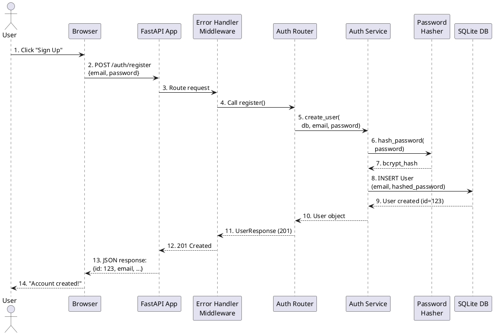

### 1.2 Login & Token Generation Flow

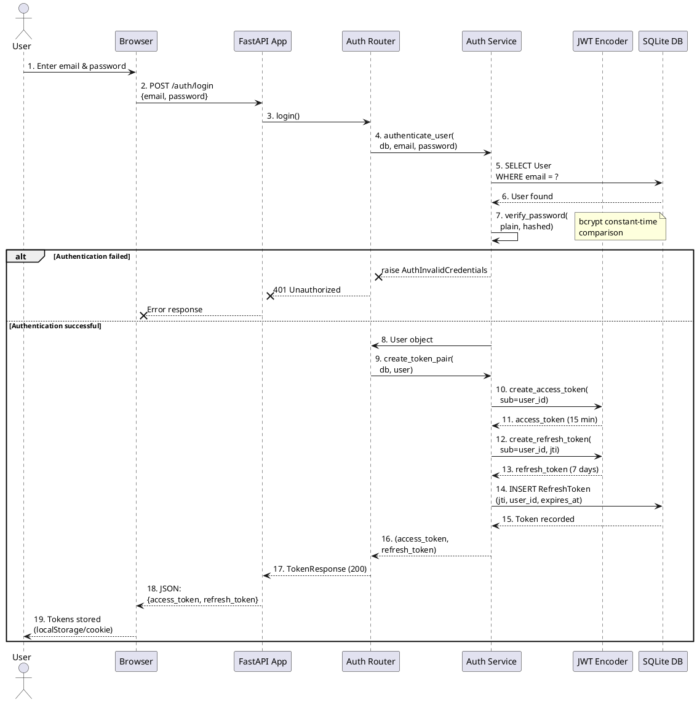

### 1.3 Token Refresh & Rotation Flow

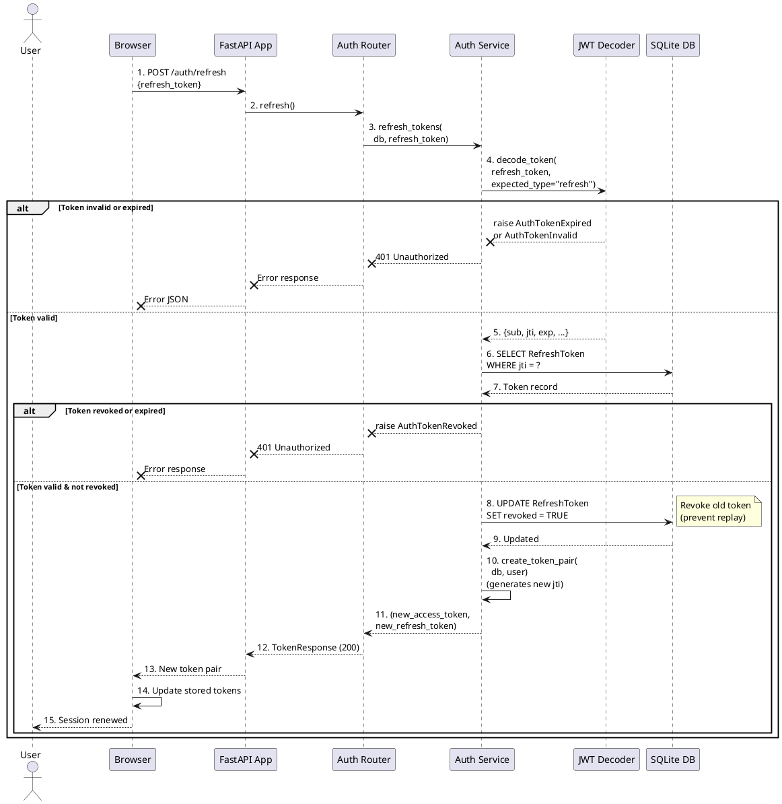

### 1.4 Logout Flow

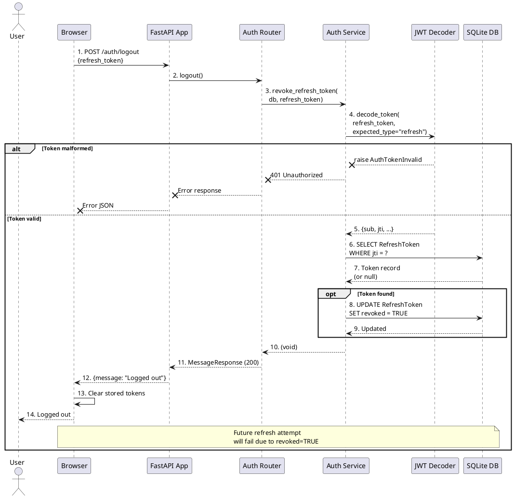

---

## 2. State Diagrams

### 2.1 Circuit Breaker State Machine

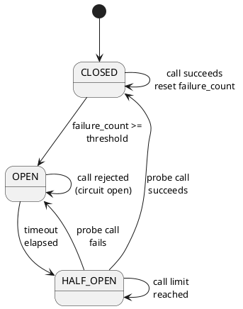

### 2.2 Authentication State Machine

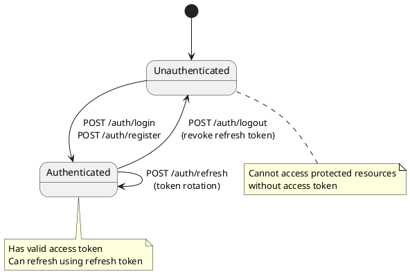

---

## 3. Data Flow Diagrams

### 3.1 Request Processing Pipeline

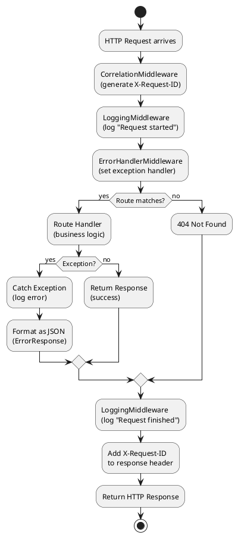

### 3.2 Database Entity Relationship

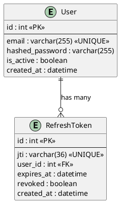

### 3.3 JWT Token Claims Structure

```plantuml
@startuml jwt_structure
card "Access Token" {
  field sub: "user_id"
  field jti: "unique_token_id"
  field type: "access"
  field exp: "expiration_timestamp"
  field iat: "issued_at_timestamp"
}

card "Refresh Token" {
  field sub: "user_id"
  field jti: "unique_token_id"
  field type: "refresh"
  field exp: "expiration_timestamp"
  field iat: "issued_at_timestamp"
}

card "Database\nRefreshToken Record" {
  field id: "primary_key"
  field jti: "matches_token_jti"
  field user_id: "links_to_user"
  field expires_at: "expiration_time"
  field revoked: "logout_flag"
  field created_at: "issued_time"
}

"Access Token" --> "Refresh Token": "same jti"
"Refresh Token" --> "Database\nRefreshToken Record": "lookup by jti"

@enduml
```

---

## 4. Error Handling Flow

### 4.1 Exception Hierarchy & HTTP Mapping

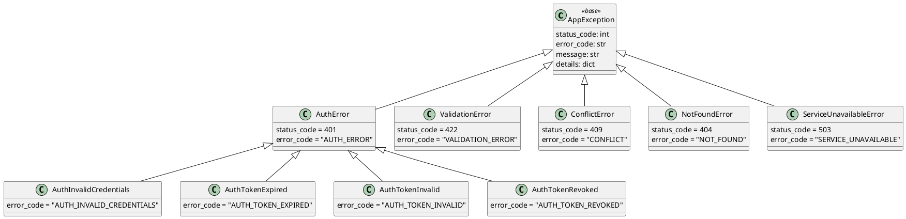

### 4.2 Error Response Format

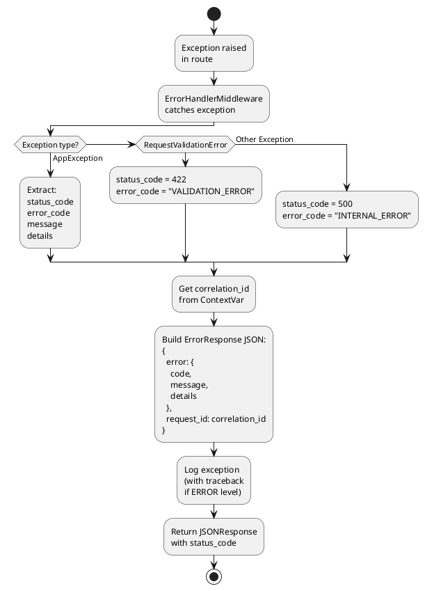

---

## 5. Middleware Execution Order

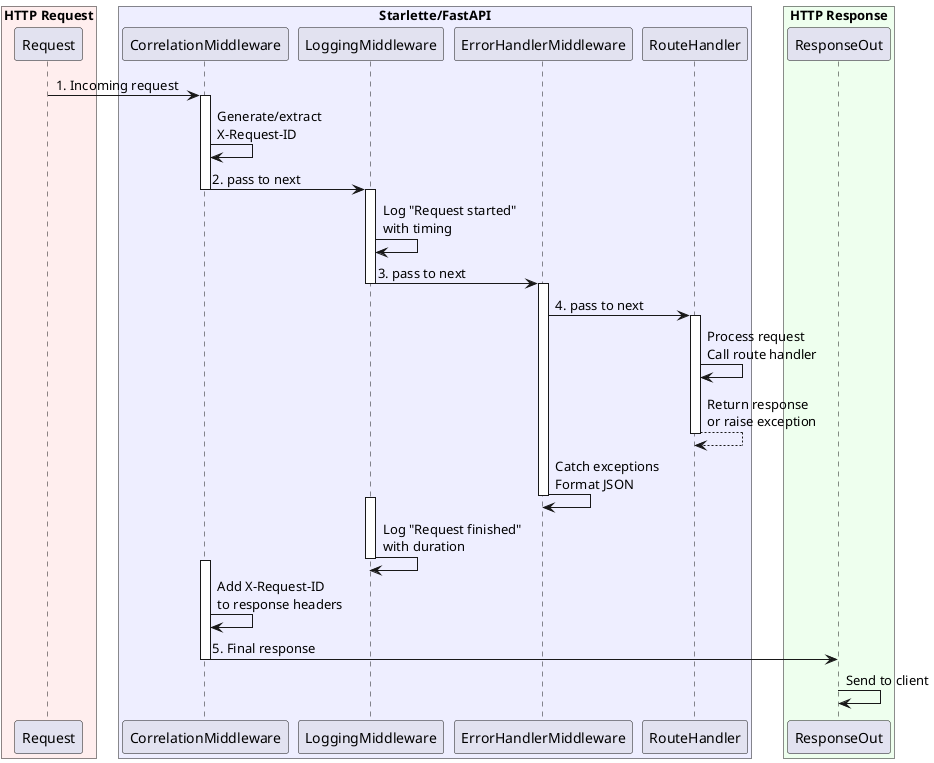

---

## 6. Token Lifecycle

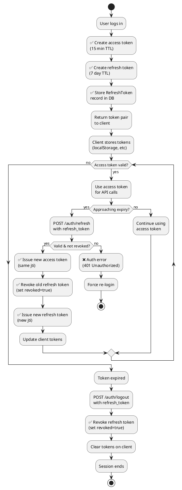

---

## 7. Logging Flow

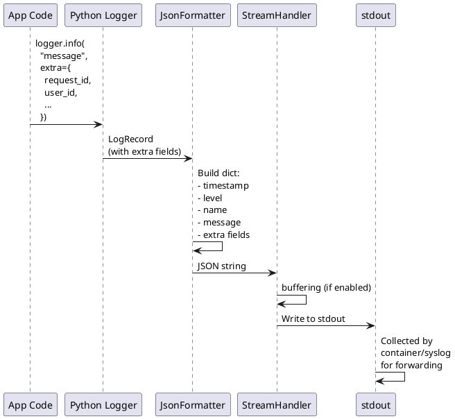

---

## 8. Password Hashing & Verification

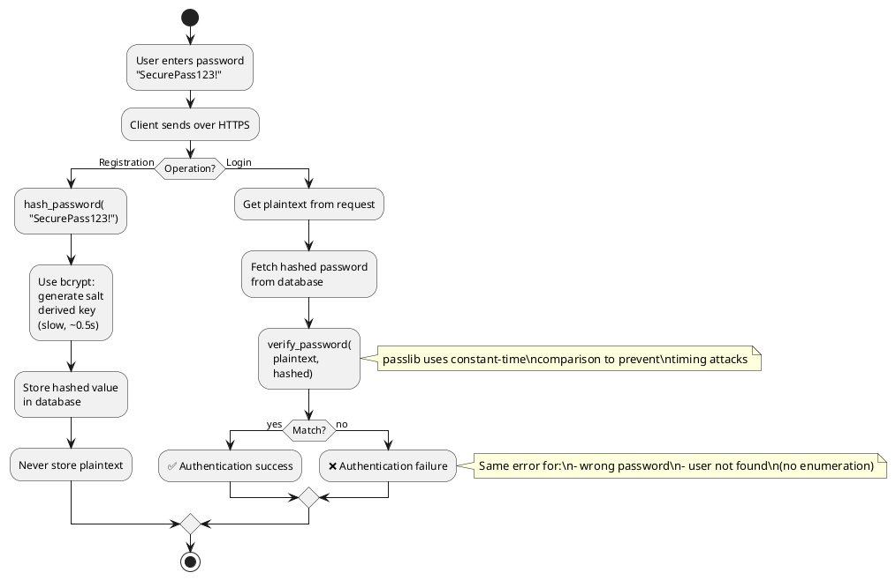

---

## 9. Configuration & Environment

```plantuml
@startuml configuration
card "Environment\nVariables" {
  SECRET_KEY
  DATABASE_URL
  ACCESS_TOKEN_EXPIRE_MINUTES
  REFRESH_TOKEN_EXPIRE_DAYS
  LOG_LEVEL
  DEBUG
}

card "Pydantic\nSettings" {
  model_config = SettingsConfigDict(
    env_file=".env"
  )
}

card "Application" {
  config.settings
  JWT algorithms
  Database engine
  Logging level
}

"Environment\nVariables" --> "Pydantic\nSettings": load from .env

"Pydantic\nSettings" --> Application: singleton\ninstance

@enduml
```

---

## 10. Deployment Architecture

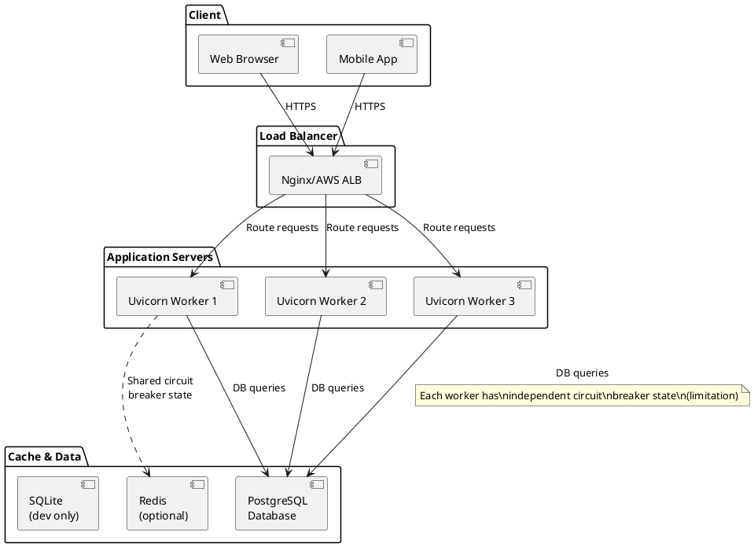

---

## Summary

These diagrams illustrate:

1. **Sequence diagrams** — User interactions and system flows
2. **State diagrams** — Circuit breaker and authentication states
3. **Data flow** — Request processing, database schema, tokens
4. **Error handling** — Exception hierarchy and response formatting
5. **Middleware** — Execution order and request processing
6. **Token lifecycle** — From creation to expiration
7. **Security** — Password hashing and verification
8. **Configuration** — Environment setup
9. **Deployment** — Production architecture

All diagrams are in PlantUML format and can be rendered using:
- PlantUML online editor: https://www.plantuml.com/plantuml/uml/
- VS Code PlantUML extension
- GitHub (renders PlantUML in markdown)

---

**Diagrams completed:** 2026-02-18
